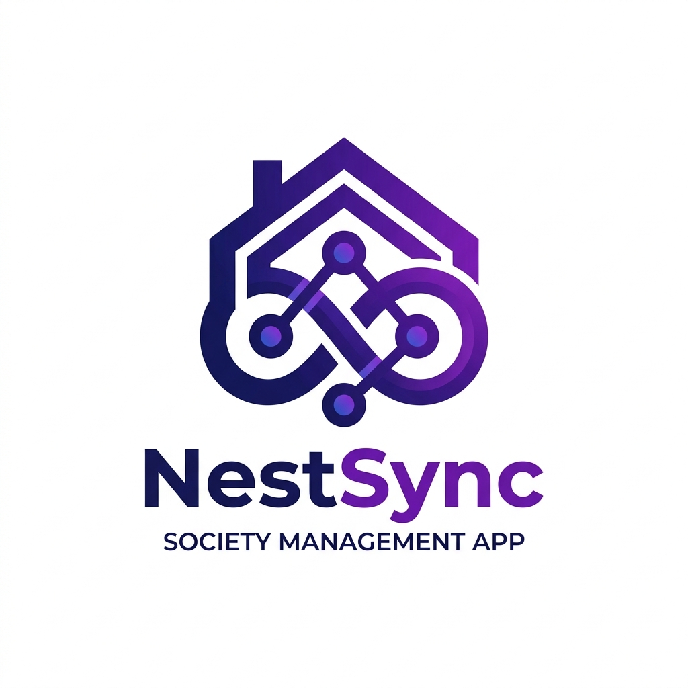
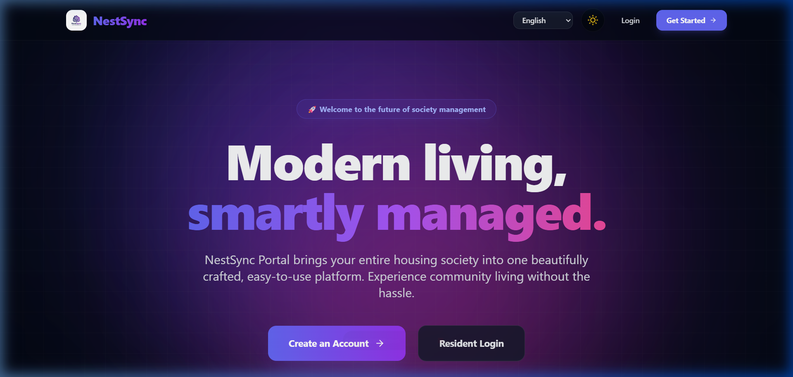
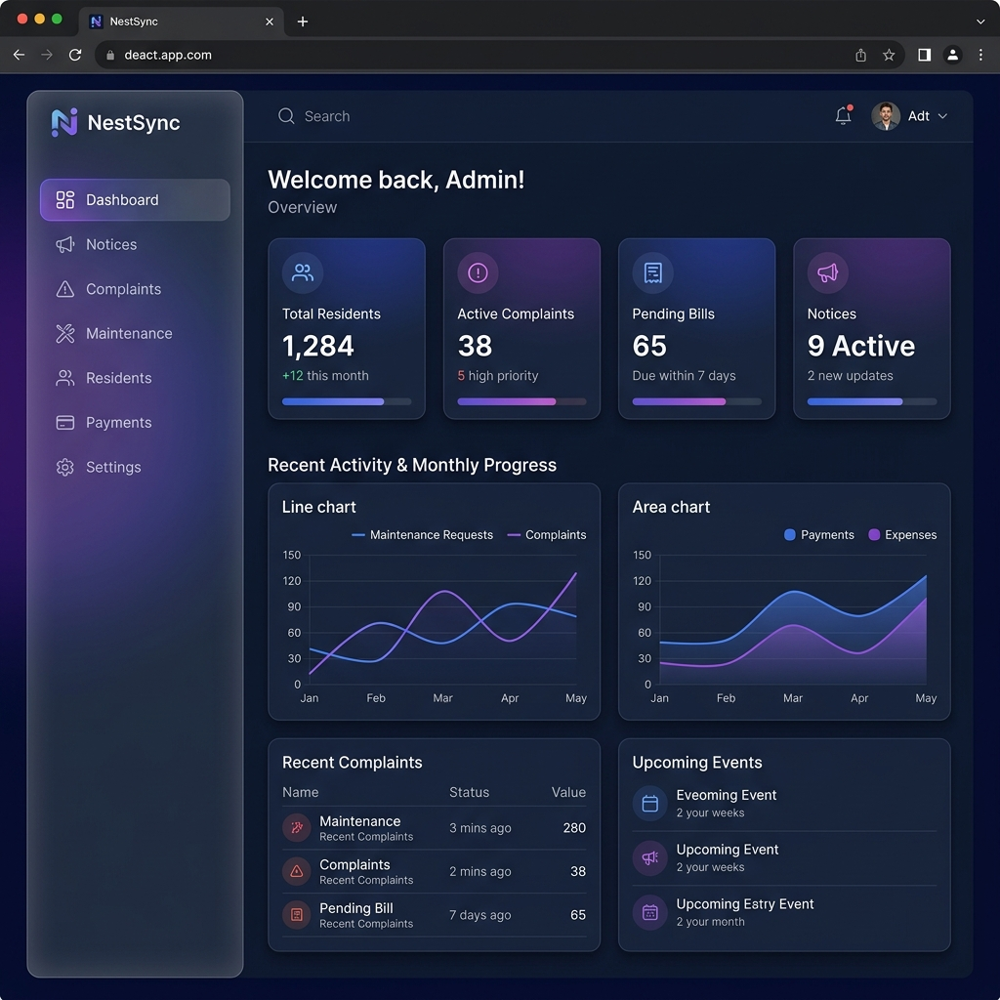
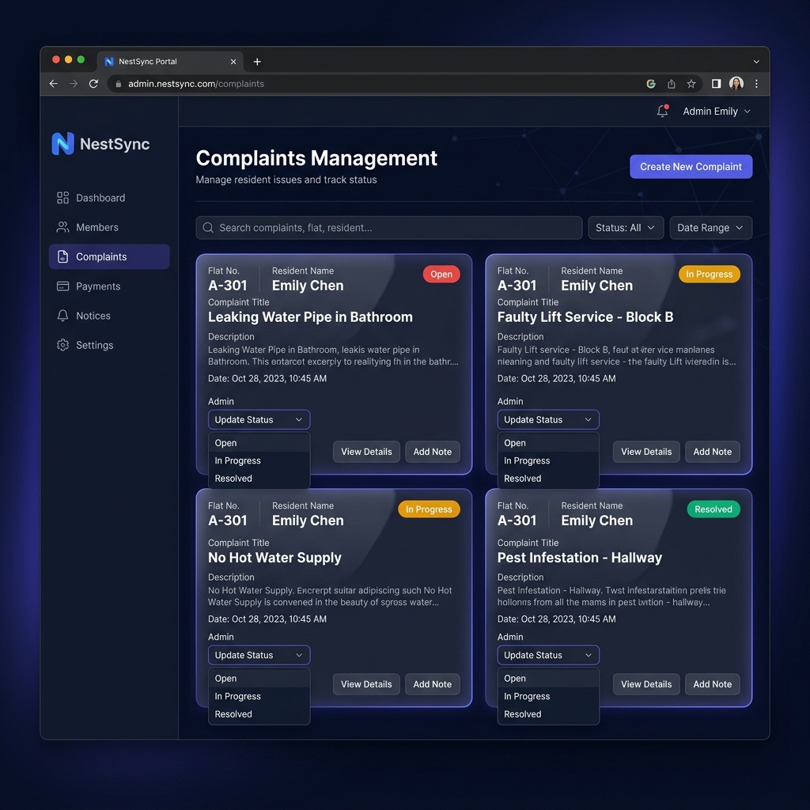

<div align="center">



# NestSync Portal

### Modern Society Management. Smartly Delivered.

A full-stack, cloud-ready **Progressive Web App (PWA)** built for Indian co-operative housing societies. Features real-time socket updates, a glassmorphism dark/light UI, multilingual support for all official Indian languages, secure role-based access, and push notifications.

[](https://nestsync-portal-project.vercel.app)
[](https://github.com/Sudip294/nestsync)
[](LICENSE)

</div>

---

## 📸 Screenshots

<table>
  <tr>
    <td align="center"><strong>🏠 Landing Page</strong></td>
    <td align="center"><strong>📊 Admin Dashboard</strong></td>
    <td align="center"><strong>🚨 Complaints Portal</strong></td>
  </tr>
  <tr>
    <td></td>
    <td></td>
    <td></td>
  </tr>
</table>

---

## ✨ Features

| Feature | Description |
|---|---|
| 🎨 **Premium UI** | Glassmorphism dark/light mode with Framer Motion animations and Tailwind CSS |
| 🔐 **Role-Based Access** | Separate portals for **Admins** and **Residents** secured with JWT |
| 🌐 **Multilingual** | Custom Google Translate integration — English + 12 official Indian languages |
| 📢 **Notices Board** | Admins broadcast announcements; residents see them in real-time |
| 🔧 **Complaints System** | Residents file complaints; Admins update status (Open → In Progress → Resolved) |
| 💳 **Maintenance Billing** | Admins post bills per-flat or bulk; residents see their dues & payment history |
| ⚡ **Real-Time Updates** | Socket.io powers instant updates without page refresh |
| 📲 **PWA + Push Alerts** | Installable on all devices with Web Push Notifications for new events |
| 🧑‍💼 **Profile Management** | Upload profile photo, edit details, and delete account with cascade cleanup |
| 🏢 **Society Customisation** | Admin can set society name and upload logo shown across the portal |
| 🔑 **Forgot Password** | Secure OTP-based password reset via Resend email API |

---

## 🛠️ Tech Stack

### Frontend
| Technology | Purpose |
|---|---|
| **React 19** + **Vite 8** | Fast, modern SPA framework |
| **Tailwind CSS v3** | Utility-first styling |
| **Framer Motion** | Smooth page & component animations |
| **React Router v7** | Client-side routing |
| **Socket.io-client** | Real-time WebSocket communication |
| **Axios** | HTTP client for API requests |
| **React Icons** | Icon library |
| **vite-plugin-pwa** | PWA manifest & service worker |
| **Google Translate API** | Multilingual support (custom UI) |

### Backend
| Technology | Purpose |
|---|---|
| **Node.js** + **Express 5** | RESTful API server |
| **MongoDB** + **Mongoose 9** | NoSQL database & ODM |
| **Socket.io** | Real-time bi-directional events |
| **JWT (jsonwebtoken)** | Authentication & session management |
| **bcrypt** | Password hashing |
| **Helmet** | HTTP security headers |
| **express-rate-limit** | API abuse prevention |
| **Resend API** | Transactional emails (OTP/password reset) |
| **Web-Push** | Server-side push notifications |

---

## 📁 Project Structure

```
nestsync/
├── frontend/               # Vite + React PWA
│   ├── public/
│   │   └── logo.png        # App logo / favicon / PWA icon
│   ├── src/
│   │   ├── components/
│   │   │   ├── layout/     # Navbar, Sidebar
│   │   │   ├── ui/         # ThemeToggle, LanguageSelector, ...
│   │   │   └── ProfileModal.jsx
│   │   ├── context/        # AuthContext (global state)
│   │   ├── pages/          # Landing, Login, Register, Dashboard,
│   │   │                   # Notices, Complaints, Maintenance, ForgotPassword
│   │   └── sw.js           # Custom service worker
│   └── index.html          # Google Translate initialised here
│
└── backend/                # Node.js + Express API
    ├── controllers/        # Business logic
    ├── middleware/         # Auth guards (protect, adminOnly)
    ├── models/             # Mongoose schemas (User, Notice, Complaint, ...)
    ├── routes/             # API route definitions
    └── server.js           # App entry point
```

---

## 🚀 Getting Started (Local Development)

### Prerequisites
- **Node.js** v18+
- **MongoDB** running locally on port `27017` — or a free [MongoDB Atlas](https://www.mongodb.com/cloud/atlas) cluster URI
- A free [Resend](https://resend.com) account for email OTPs *(optional but recommended)*

---

### 1. Clone the Repository

```bash
git clone https://github.com/Sudip294/nestsync.git
cd nestsync
```

### 2. Configure Backend Environment Variables

```bash
cd backend
```

Create a `.env` file (or edit the existing one):

```env
PORT=5000
MONGO_URI=mongodb://127.0.0.1:27017/society-management
JWT_SECRET=your_super_secret_jwt_key_here
RESEND_API_KEY=your_resend_api_key_here
VAPID_PUBLIC_KEY=your_vapid_public_key_here
VAPID_PRIVATE_KEY=your_vapid_private_key_here
```

> **Tip:** Generate VAPID keys with `npx web-push generate-vapid-keys`

### 3. Start the Backend

```bash
# Inside /backend
npm install
node server.js
```

The API will be available at `http://localhost:5000`

### 4. Start the Frontend

Open a **new terminal**:

```bash
# Inside /frontend
npm install
npm run dev
```

### 5. Open in Browser

Visit → **[http://localhost:5173](http://localhost:5173)**

---

## 🔑 Default Testing Credentials

You can register your own accounts, or use these for quick testing:

| Role | Email | Password |
|---|---|---|
| **Admin** | `admin2@gmail.com` | `admin2@123` |
| **Resident** | Register a new account | Your choice |

---

## 🧪 Test Flow

1. **Register** as an **Admin** → log in to the Admin Dashboard.
2. Post a **Notice** from the Admin panel.
3. **Register** a second account as a **Resident** (e.g. Flat A-402).
4. Log in as the Resident → file a **Complaint**.
5. Switch back to the Admin → update the complaint status to **In Progress**.
6. Watch the Resident's screen update **instantly** via Socket.io — no refresh needed!
7. In Admin → **Maintenance**, generate a bill for all pending residents.
8. Log in as the Resident → check the **Maintenance** tab for the due bill.

---

## 🌐 API Endpoints

### Auth
| Method | Endpoint | Description |
|---|---|---|
| `POST` | `/api/auth/register` | Register a new user |
| `POST` | `/api/auth/login` | Login & receive JWT |
| `POST` | `/api/auth/forgot-password` | Send OTP to email |
| `POST` | `/api/auth/reset-password` | Reset password with OTP |

### Users
| Method | Endpoint | Description | Auth |
|---|---|---|---|
| `GET` | `/api/users/settings` | Get society settings | Public |
| `PUT` | `/api/users/settings` | Update society name/logo | Admin |
| `PUT` | `/api/users/profile-picture` | Update profile photo | User |
| `DELETE` | `/api/users/profile` | Delete own account | User |
| `GET` | `/api/users` | Get all residents | Admin |
| `POST` | `/api/users/push-subscribe` | Save push subscription | User |

### Notices
| Method | Endpoint | Description | Auth |
|---|---|---|---|
| `GET` | `/api/notices` | Get all notices | User |
| `POST` | `/api/notices` | Create a notice | Admin |
| `DELETE` | `/api/notices/:id` | Delete a notice | Admin |

### Complaints
| Method | Endpoint | Description | Auth |
|---|---|---|---|
| `GET` | `/api/complaints` | Get complaints (role-filtered) | User |
| `POST` | `/api/complaints` | File a new complaint | Resident |
| `PUT` | `/api/complaints/:id` | Update complaint status | Admin |

### Maintenance
| Method | Endpoint | Description | Auth |
|---|---|---|---|
| `GET` | `/api/maintenance` | Get bills (role-filtered) | User |
| `POST` | `/api/maintenance` | Generate bill(s) | Admin |
| `PUT` | `/api/maintenance/:id` | Mark bill as paid | Admin |

---

## 📦 Deployment

### Frontend → Vercel / Netlify
```bash
cd frontend
npm run build
# Deploy the /dist folder
```

### Backend → Render / Railway
- Set all `.env` variables in the platform's environment settings.
- Set the start command to: `node server.js`
- Update the frontend `axios` base URL to your production backend URL.

---

## 🤝 Contributing

Pull requests are welcome! For major changes, please open an issue first.

1. Fork the repository
2. Create your feature branch: `git checkout -b feature/AmazingFeature`
3. Commit your changes: `git commit -m 'Add AmazingFeature'`
4. Push to the branch: `git push origin feature/AmazingFeature`
5. Open a Pull Request

---

## 📄 License

Distributed under the **MIT License**. See `LICENSE` for more information.

---

<div align="center">

Designed with ❤️ by **Sudip Bag**

⭐ Star this repo if you found it useful!

</div>
